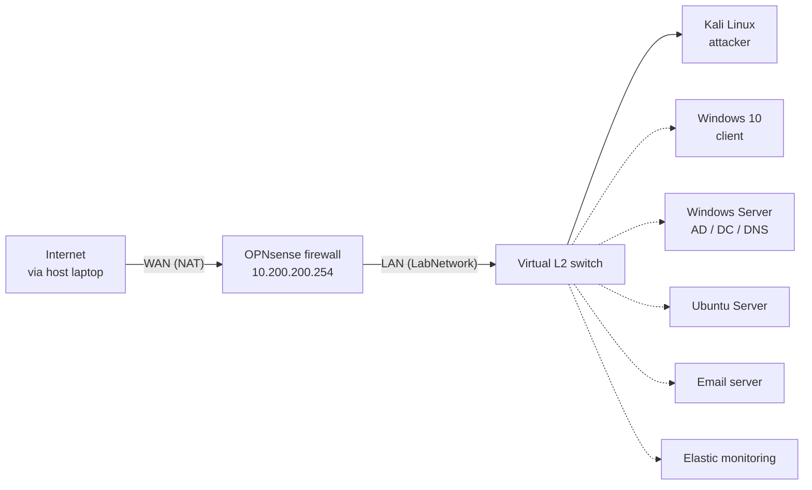

# 🛡️ Home Lab Journal

A running log of building my virtual security lab, including what went wrong and how I fixed it. New phases will be added below as I complete them.

| | |
|---|---|
| **Host** | Dell Latitude 7320, Windows 11, Intel Core i7-1185G7, 16 GB RAM, 477 GB SSD |
| **Hypervisor** | Oracle VirtualBox |
| **Following** | Lyal Saayman's home lab series |
| **Status** | Phase 1 complete, Phase 2 up next |

## Lab map



## Virtual machines so far

| VM | RAM | CPU | Disk | Network |
|----|-----|-----|------|---------|
| OPNsense | 2048 MB | 1 | 16 GB (dynamic) | Adapter 1: NAT (WAN), Adapter 2: Internal Network `LabNetwork` (LAN) |
| Kali Linux (pre-built image) | Image default | Image default | Image default | Adapter 1: Internal Network `LabNetwork` |

---

# Phase 1: VirtualBox, OPNsense firewall, Kali attacker

## Problems and fixes at a glance

| Problem | Cause | Fix |
|---------|-------|-----|
| VirtualBox installer failed | Missing Microsoft C++ runtime | Installed the Visual C++ Redistributable (x64) |
| `vm_fault: pager read error` after first OPNsense reboot | Not confirmed (see below) | Deleted the VM, rebuilt it, reinstalled |
| Kali couldn't reach the firewall | No DHCP server running on the OPNsense LAN | Temporary static IP on Kali |

## 1. Installing VirtualBox
- Ran the installer from Oracle's site on Windows 11.
- **Problem:** the installer failed because a Microsoft component was missing.
- **Fix:** installed the Microsoft Visual C++ Redistributable (2015-2022, x64). VirtualBox is built with Microsoft's C++ runtime libraries, so they must exist on the host.
- Skipped the Python Core / win32api warning. Those are only needed for scripting VirtualBox through its SDK.

## 2. Building the OPNsense VM
- Downloaded the OPNsense DVD image (amd64) and extracted the .bz2 with 7-Zip.
- VM settings: type BSD / FreeBSD (64-bit), 2048 MB RAM, 1 CPU, 16 GB dynamically allocated disk, unattended install unchecked.
- Network (Expert mode in VirtualBox settings): Adapter 1 is NAT (WAN), Adapter 2 is Internal Network named `LabNetwork` (LAN).
- Installed with the UFS option (lighter on RAM than ZFS) onto the virtual disk.

## 3. Problem: `vm_fault: pager read error` after the first reboot
- **What happened:** I removed the install CD *before* pressing Reboot, while the installer was still on its final screen. After the reboot, the VM looped on disk errors.
- **Fix:** deleted the VM and its files, rebuilt it, and reinstalled. The second install booted cleanly.

> [!NOTE]
> **Likely cause (my analysis, not proven)** My theory is that ejecting the ISO before the reboot upset the virtual disk. the presenter does it differently. He lets the VM reboot first and removes the disc while the boot screen is counting down, so the machine has already started loading from the disk. Ejecting early is my best explanation for the error, but I've only seen it once, so I'll keep following his order and note whether the error ever returns.
## 4. Configuring the interfaces
- First boot showed the LAN on the default `192.168.1.1` and no WAN address.
- Used console option 1 to assign **WAN = em0 (NAT)** and **LAN = em1 (LabNetwork)**.
- Used option 2 to set the LAN to `10.200.200.254/24`. This is a private range I chose so the firewall has a fixed, predictable gateway address.

## 5. Kali Linux
- Imported the official pre-built VirtualBox image (Machine > Add, select the .vbox file).
- Set Kali's Adapter 1 to Internal Network `LabNetwork`. The name is case sensitive.

## 6. Problem: Kali couldn't reach the firewall
- Firefox showed "Unable to connect" for `https://10.200.200.254`.
- `ip a` showed no IPv4 address on eth0, and trying to request one gave a `169.254.x.x` fallback address, which means no DHCP server answered.
- **Cause:** OPNsense isn't running a DHCP server on the LAN yet. That is configured in the web interface, which I couldn't reach.
- **Workaround:** gave Kali a temporary static address.

```bash
sudo ip addr add 10.200.200.10/24 dev eth0
ping -c 4 10.200.200.254
```

- **Result:** the ping succeeded and the OPNsense login page loaded in Firefox.

> [!WARNING]
> This address disappears when Kali reboots. It is a stopgap until DHCP is enabled on OPNsense.

## What I learned in Phase 1
- When something won't connect, check the basics first: is the other VM running, do the network names match exactly, and does `ip a` show an IPv4 address?
- Follow the presenter's order on steps involving ISO ejection and reboots.
- Treat explanations of causes as theories until I can prove them.

## Next
- [ ] Log in to the OPNsense web GUI and run the setup wizard
- [ ] Enable DHCP on the LAN
- [ ] Build the Windows Server (Active Directory) and Windows 10 VMs

---

# Phase 2: Active Directory and victim endpoint

*Coming soon.*
